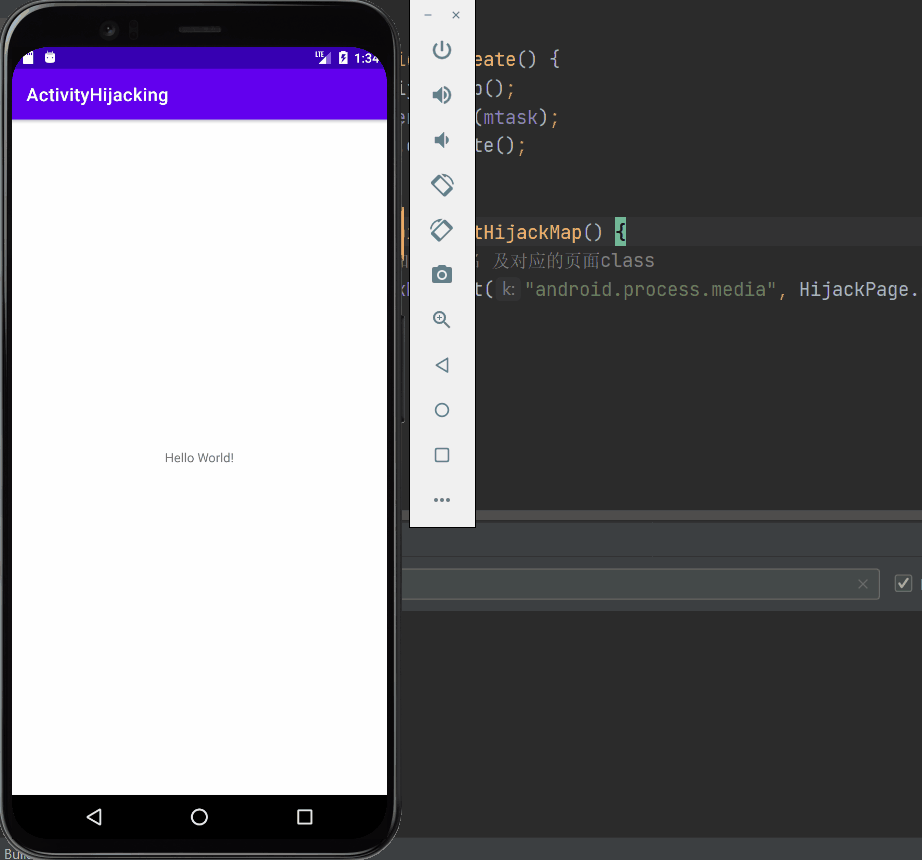

# Activity漏洞：Activity劫持/钓鱼欺诈

Activity劫持：APP正常的Activity界面被恶意攻击者替换上仿冒的恶意Activity界面，来进行攻击或其他非法用途。

### 漏洞原理

>Android APP中不同界面的切换通过Activity的调度来实现，而Acticity的调度是由Android系统中的AMS来实现。每个应用想启动或停止一个进程，都报告给AMS，AMS收到启动或停止Activity的消息时，先更新内部记录，再通知相应的进程或停止指定的Activity。当新的Activity启动，前一个Activity就会停止，这些Activity会保留在系统中的一个Activity历史栈中。每有一个Activity启动，它就压入历史栈顶，并在手机上显示。当用户按下back，顶部的Activity弹出，恢复前一个Activity，栈顶指向当前的Activity。
>
>由于Activity的这种特性，如果在启动一个Activity时，给它加入一个标志位`FLAGACTIVITYNEW_TASK`，就能使它置于栈顶并立马呈现给用户，如果这个Activity是用于盗号的伪装Activity，就会产生钓鱼安全事件；或者一个Activity中有`webview`加载，允许加载任意网页，都有可能产生钓鱼事件。


### 实验步骤

环境 Pixel 4 XL API23模拟器（Android6.0）

#### 1. 编写攻击app

##### 1.1 新建`HijackingService`服务

负责后台检测前台应用，并当前台应用为指定应用时唤起attack伪装界面

编写伪装Activity

##### 1.2 编写`MainActivity`

负责一打开app就启动`HijackingService`劫持服务

##### 1.3 编写注册`HijackingReciver`广播接收者

负责监听开机事件，一开机就启动`HijackingService`劫持服务


### 2. 运行app

运行app，并打开系统相机

效果图：


### 如何防范

#### （1）在暂停或停止时提示用户

在`onPause()`中及时提醒用户

```java
@Override
public boolean onKeyDown(int keyCode, KeyEvent event) {
    //判断程序进入后台是否是用户自身造成的（触摸返回键或HOME键），是则无需弹出警示。
    if((keyCode==KeyEvent.KEYCODE_BACK || keyCode==KeyEvent.KEYCODE_HOME) && event.getRepeatCount()==0){
        needAlarm = false;
    }
    return super.onKeyDown(keyCode, event);
}

@Override
protected void onPause() {
    //若程序进入后台不是用户自身造成的，则需要弹出警示
    if(needAlarm) {
        //弹出警示信息
        Toast.makeText(getApplicationContext(), "您的登陆界面被覆盖，请确认登陆环境是否安全", Toast.LENGTH_SHORT).show();
        //启动我们的AlarmService,用于给出覆盖了正常Activity的类名
        Intent intent = new Intent(this, AlarmService.class);
        startService(intent);
    }
    super.onPause();
}
```

#### （2）进入后台时使用通知提示

 如果当前的程序进入后台，那么使用`Notification`提示用户进程已经进进入后台运行。

