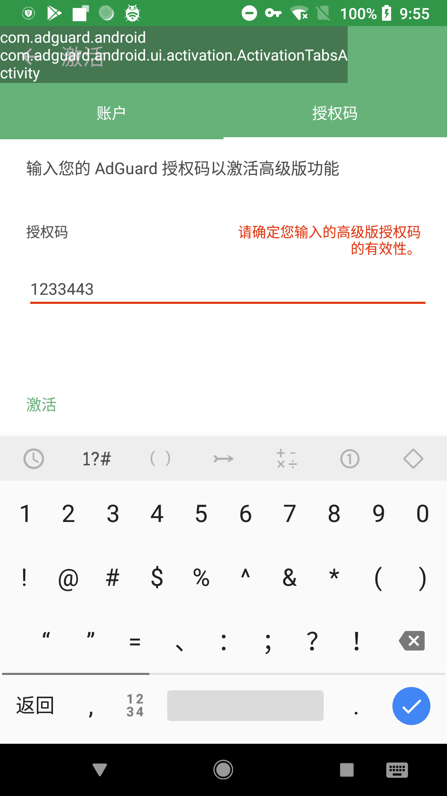
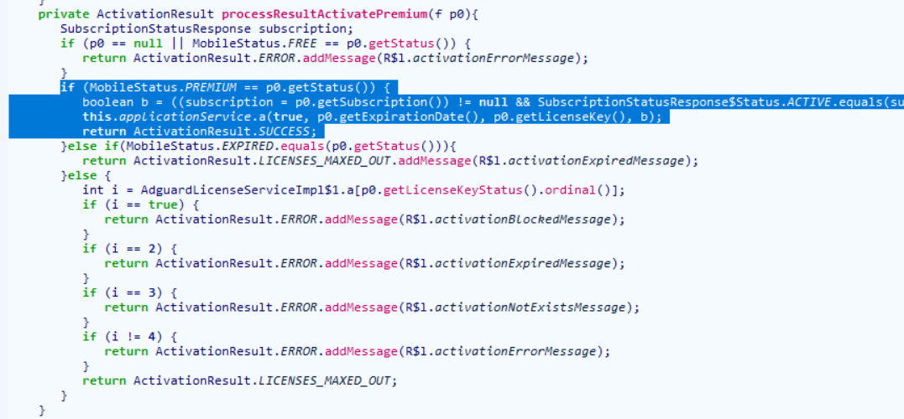
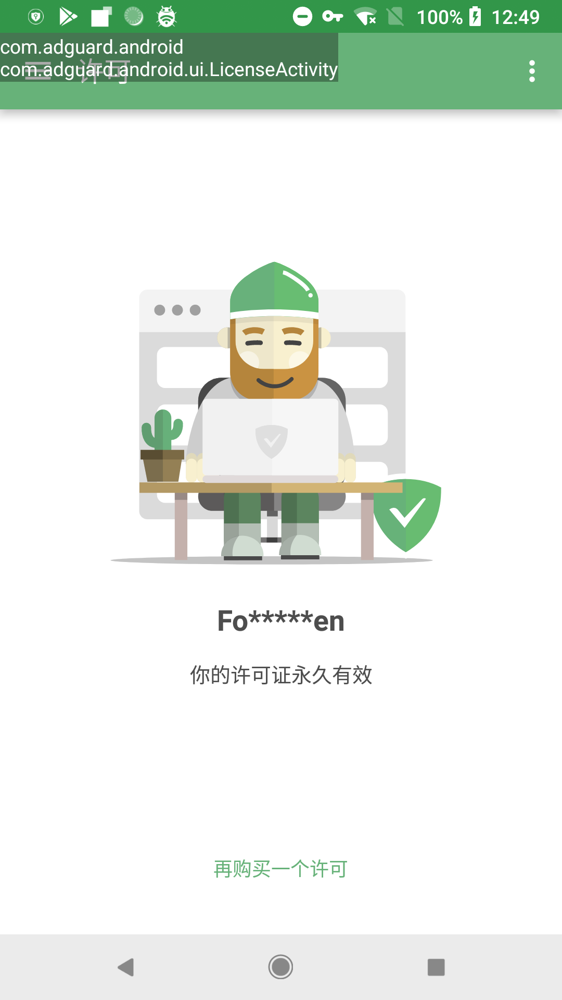

# AdGuard高级版解锁

官网：[AdGuard - 世界上最高级的广告拦截程序！](https://adguard.com/zh_cn/welcome.html)

version：3.6.38


## 分析过程

第一步查壳，没有加固

随意输入点击注册，获得提示



根据提示找到类，圈出来的部分即为专业版



思路就是构造相应的信息，然后执行这段代码完成高级版激活


### Frida脚本

```javascript
function main() {
    Java.perform(function () {
        Java.use("com.adguard.android.service.license.AdguardLicenseServiceImpl").processResultActivatePremium.implementation = function () {
            arguments[0] = Java.use("com.adguard.android.api.dto.f").$new();
            console.log(JSON.stringify(arguments[0]));
            return this.processResultActivatePremium(arguments[0]);
        };
    });

    Java.perform(function () {
        Java.use("com.adguard.android.api.dto.f").getLicenseKey.implementation = function () {
            console.log("getLicenseKey()");
            return Java.use("java.lang.String").$new("Forgo7ten");
        };
        Java.use("com.adguard.android.api.dto.f").getCountryCode.implementation = function () {
            console.log("getCountryCode()");
            return Java.use("java.lang.String").$new("Forgo7ten");
        };
        Java.use("com.adguard.android.api.dto.f").getExpirationDate.implementation = function () {
            console.log("getExpirationDate()");
            return Java.use("java.util.Date").$new(4071659401000);
        };
        Java.use("com.adguard.android.api.dto.f").getLicenseKeyStatus.implementation = function () {
            console.log("getLicenseKeyStatus()");
            return this.getLicenseKeyStatus();
        };
        Java.use("com.adguard.android.api.dto.f").getStatus.implementation = function () {
            console.log("getStatus()");
            return Java.use("com.adguard.android.model.enums.MobileStatus").PREMIUM.value;
        };
    });
}

setImmediate(main);

```

不知道会不会有校验



为了可以自动激活，便在该服务调用完构造方法后主动调用`processResultActivatePremium()`来激活

```javascript
Java.perform(function () {
    Java.use("com.adguard.android.service.license.AdguardLicenseServiceImpl").$init.implementation = function () {
        var result = this.$init(arguments[0], arguments[1], arguments[2], arguments[3], arguments[4]);
        this.processResultActivatePremium(null);
        return result;
    };
});
```

### 编写Smali进行打包

修改`processResultActivatePremium()`方法

```smali
.method private processResultActivatePremium(Lcom/adguard/android/api/dto/f;)Lcom/adguard/android/model/enums/ActivationResult;
    .locals 4

    new-instance v0, Ljava/util/Date;

    const-wide v2, 0x3b401cfef28L

    invoke-direct {v0, v2, v3}, Ljava/util/Date;-><init>(J)V

    const/4 v3, 0x1

    const/4 v2, 0x1

    iget-object v1, p0, Lcom/adguard/android/service/license/AdguardLicenseServiceImpl;->applicationService:Lcom/adguard/android/service/f;

    const-string p1, "Forgo7ten"

    invoke-interface {v1, v2, v0, p1, v3}, Lcom/adguard/android/service/f;->a(ZLjava/util/Date;Ljava/lang/String;Z)V

    .line 135
    sget-object p1, Lcom/adguard/android/model/enums/ActivationResult;->SUCCESS:Lcom/adguard/android/model/enums/ActivationResult;

    return-object p1
.end method
```

刚开始在构造方法中调用，结果一直卡在开屏界面进不去，frida在相同位置调用则不会有报错，翻了半天log没有找到头绪，后来发现每次都会调用`isTrialAvailable()`方法来验证是否是试用，于是在这个方法的开头调用了激活方法

```smali
.method public isTrialAvailable()Z
    .locals 1

    invoke-direct {p0}, Lcom/adguard/android/service/license/AdguardLicenseServiceImpl;->myProcessResultActivatePremium()Lcom/adguard/android/model/enums/ActivationResult;
```

同时由于原激活函数的参数比较难构造，自己添加了一个只是删去参数的方法

```smali
.method private myProcessResultActivatePremium()Lcom/adguard/android/model/enums/ActivationResult;
    .locals 5

    new-instance v0, Ljava/util/Date;

    const-wide v2, 0x3b401cfef28L

    invoke-direct {v0, v2, v3}, Ljava/util/Date;-><init>(J)V

    const/4 v3, 0x1

    const/4 v2, 0x1

    iget-object v1, p0, Lcom/adguard/android/service/license/AdguardLicenseServiceImpl;->applicationService:Lcom/adguard/android/service/f;

    const-string v4, "Forgo7ten"

    invoke-interface {v1, v2, v0, v4, v3}, Lcom/adguard/android/service/f;->a(ZLjava/util/Date;Ljava/lang/String;Z)V

    .line 135
    sget-object v4, Lcom/adguard/android/model/enums/ActivationResult;->SUCCESS:Lcom/adguard/android/model/enums/ActivationResult;

    return-object v4
.end method
```

## 最终效果


