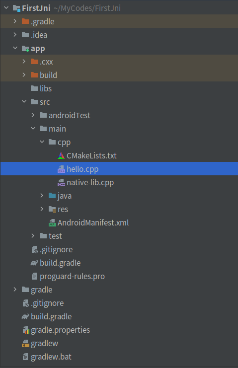

# NDK开发：第一个Jni实践


## 1. 使用AS新建一个ndk项目

1.   new一个project
2.   选择模板Native C++
3.   Next，修改项目名、包名、及所在目录，Next，Finish

目录结构：




Android开发者文档：[向您的项目添加 C 和 C++ 代码  | Android 开发者  | Android Developers (google.cn)](https://developer.android.google.cn/studio/projects/add-native-code)

## 2. 新建so源文件并在java中调用

1.   在`cpp`文件夹内新建`hello.cpp`

2.   在`hello.cpp`中添加代码

     ```c++
     #include <jni.h>
     #include <string>
     
     extern "C" JNIEXPORT jstring JNICALL
     Java_com_forgotten_firstjni_MainActivity_stringFromHello(
             JNIEnv* env,
             jobject /* this */) {
         std::string hello = "Hello from Hello";
         return env->NewStringUTF(hello.c_str());
     }
     ```

3.   修改`CMakeLists.txt`

     ```
      add_library( # Sets the name of the library.
      			 # 生成的so文件名字，同时需要在java代码中System.loadLibrary()的名字
                  hello
     
                  # Sets the library as a shared library. 设置是静态STATIC或者动态SHARD
                  SHARED
     
                  # Provides a relative path to your source file(s).
                  # so源文件相对路径
                  hello.cpp )
     
     ############# 也可以编译多个源文件进入同一个so文件 #############
     
      add_library( # Sets the name of the library.
                  firstjni
     
                  # Sets the library as a shared library.
                  SHARED
     
                  # Provides a relative path to your source file(s).
                  native-lib.cpp
                  hello.cpp)
     ```

4.   修改Java代码

     ```java
     public class MainActivity extends AppCompatActivity {
     
         // Used to load the 'firstjni' library on application startup.
         static {
             System.loadLibrary("firstjni");
         }
     
         private ActivityMainBinding binding;
     
         @Override
         protected void onCreate(Bundle savedInstanceState) {
             super.onCreate(savedInstanceState);
     
             binding = ActivityMainBinding.inflate(getLayoutInflater());
             setContentView(binding.getRoot());
     
             // Example of a call to a native method
             TextView tv = binding.sampleText;
             // tv.setText(stringFromJNI());
             tv.setText(stringFormHello());
         }
     
         /**
          * A native method that is implemented by the 'firstjni' native library,
          * which is packaged with this application.
          */
         public native String stringFromJNI();
     
         public native String stringFormHello();
     }
     ```


运行成功


# JNI使用对象

## 1. 新建一个Person类作为测试

```java
public class Person {
    public static int sNumber;
    private static String country;
    private String mName;
    public int mAge;

    static {
        sNumber = 100;
        country = "China";
    }
}
```

## 2. 在hello.cpp中编写相关方法进行测试

之后要在java中引用so库，声明并调用native函数


### static field的get和set

```c++
extern "C" JNIEXPORT void JNICALL Java_com_forgotten_firstjni_MainActivity_useObjectStaticField(
        JNIEnv *env,
        jobject /* this */) {
    // 查找该类
    jclass person_clazz = env->FindClass("com/forgotten/firstjni/Person");
    // 查找(公共)静态字段ID
    jfieldID number_fieldID = env->GetStaticFieldID(person_clazz, "sNumber", "I");
    // 获取该字段的值
    jint number = env->GetStaticIntField(person_clazz, number_fieldID);
    __android_log_print(ANDROID_LOG_DEBUG, "useObjectStaticField", "before sNumber=%d", number);
    env->SetStaticIntField(person_clazz,number_fieldID,999);
    __android_log_print(ANDROID_LOG_DEBUG, "useObjectStaticField", "after sNumber=%d", number);
    // 查找(私有)静态字段ID  同公有 | jni中不分公私
    jfieldID country_fieldID = env->GetStaticFieldID(person_clazz,"country", "Ljava/lang/String;");
    jstring country_jstr = static_cast<jstring>(env->GetStaticObjectField(person_clazz,
                                                                          country_fieldID));
    const char* country_chars = env->GetStringUTFChars(country_jstr, nullptr);
    __android_log_print(ANDROID_LOG_DEBUG,"useObjectStaticField","country=%s",country_chars);
}
```

### field的get和set

需要先实例化对象，实例化对象两种方式

第一种使用`enc->NewObject()`方式(常用)

```c++
extern "C" JNIEXPORT void JNICALL Java_com_forgotten_firstjni_MainActivity_useObjectField1(
        JNIEnv *env,
        jobject /* this */) {
    // 查找该类
    jclass person_clazz = env->FindClass("com/forgotten/firstjni/Person");
    // 查找构造方法的methodID
    jmethodID constructID1 = env->GetMethodID(person_clazz,"<init>", "()V");
    // 进行对象的实例化
    jobject person1 = env->NewObject(person_clazz,constructID1);
    // 查找到字段name的fieldID
    jfieldID nameID = env->GetFieldID(person_clazz,"mName", "Ljava/lang/String;");
    // 通过对象和fieldID获取存储的值
    jstring name_jstr = static_cast<jstring>(env->GetObjectField(person1, nameID));
    // 将jstring转换为char×类型
    const char * name_chars = env->GetStringUTFChars(name_jstr, nullptr);
    __android_log_print(ANDROID_LOG_DEBUG, "useObjectField1", "name=%s", name_chars);

    // 使用完需要释放掉该字符串  不确定是否这么用
    env->ReleaseStringUTFChars(name_jstr, name_chars);
    __android_log_print(ANDROID_LOG_DEBUG, "useObjectField1", "name=%s", name_chars);
    // 好像释放了后还是可以用…… 晕

    jmethodID constructID2 = env->GetMethodID(person_clazz,"<init>", "(Ljava/lang/String;)V");
    // 给有参构造函数设置参数并执行获得对象
    jobject person2 = env->NewObject(person_clazz,constructID2,env->NewStringUTF("Hello"));
    jstring name_jstr2 = static_cast<jstring>(env->GetObjectField(person2, nameID));
    __android_log_print(ANDROID_LOG_DEBUG, "useObjectField1", "param name=%s", env->GetStringUTFChars(name_jstr2, nullptr));

}
```

使用`env->CallNonvirtualVoidMethod()`方式来获得对象

```c++
extern "C" JNIEXPORT void JNICALL Java_com_forgotten_firstjni_MainActivity_useObjectField2(
        JNIEnv *env,
        jobject /* this */) {
    // 查找该类
    jclass person_clazz = env->FindClass("com/forgotten/firstjni/Person");
    // 查找构造方法的methodID
    jmethodID constructID = env->GetMethodID(person_clazz,"<init>", "()V");
    // 新建一个对象，但没有进行初始化
    jobject person_obj = env->AllocObject(person_clazz);
    // 对对象进行初始化，第四个参数为 params...
    env->CallNonvirtualVoidMethod(person_obj, person_clazz, constructID);
    // 查找到字段name的fieldID
    jfieldID nameID = env->GetFieldID(person_clazz,"mName", "Ljava/lang/String;");
    jstring name_jstr2 = static_cast<jstring>(env->GetObjectField(person_obj, nameID));
    __android_log_print(ANDROID_LOG_DEBUG, "useObjectField2", "name=%s", env->GetStringUTFChars(name_jstr2, nullptr));

}
```

### 对int[]数组类型的处理

```c++
/**
 * 使用array数组
 */
extern "C" JNIEXPORT void JNICALL Java_com_forgotten_firstjni_MainActivity_useArray(
        JNIEnv *env,
        jobject /* this */) {
    // 查找该类
    jclass person_clazz = env->FindClass("com/forgotten/firstjni/Person");
    // 查找(公共)静态字段ID
    jfieldID array_fieldID = env->GetStaticFieldID(person_clazz, "testArray", "[I");
    jintArray tarray = static_cast<jintArray>(env->GetStaticObjectField(person_clazz,
                                                                        array_fieldID));
    // 获得array的长度
    int length =  env->GetArrayLength(tarray);
    // 获得指向array的int指针
    int* p =  env->GetIntArrayElements(tarray, nullptr);
    for(int i=0;i<length;++i){
        // 循环打印array
        __android_log_print(ANDROID_LOG_DEBUG, "useArray", "array[%d]=%d",i,p[i]);
    }
    int newarr[length];
    for(int i =0;i<length;++i){
        newarr[i] = 100-i;
    }
    // 对数组中的值进行修改
    env->SetIntArrayRegion(tarray,0,length,newarr);
}

```


### 调用静态与非静态方法

```c++
/**
 * JNI调用静态与非静态方法
 */
extern "C"
JNIEXPORT void JNICALL
Java_com_forgotten_firstjni_MainActivity_useMethod(JNIEnv *env, jobject thiz) {
    // 查找该类
    jclass person_clazz = env->FindClass("com/forgotten/firstjni/Person");
    // 找到相应的构造方法
    jmethodID constructID = env->GetMethodID(person_clazz, "<init>", "(Ljava/lang/String;)V");
    jstring hello_js = env->NewStringUTF("Hello");
    // 给有参构造函数设置参数并执行获得对象
    jobject person_obj = env->NewObject(person_clazz, constructID, hello_js);

    // 获得Person类中的静态方法ID
    jmethodID sMethod_mid = env->GetStaticMethodID(person_clazz,"sMethod", "(Ljava/lang/String;)I");
    // 相应的方法还有CallStaticIntMethodA,CallStaticIntMethodV 只是传递的参数形式不同
    // 中间的int是返回值，如果方法的返回值为void时，则应调用CallVoidMethod()
    int hello_len = env->CallStaticIntMethod(person_clazz,sMethod_mid,hello_js);
    __android_log_print(ANDROID_LOG_DEBUG, "useMethod", "hello_len=%d", hello_len);

    // 获得Person类中的非静态方法ID
    jmethodID mMethod_mid = env->GetMethodID(person_clazz,"mMethod","(Ljava/lang/String;)I");
    int hello_2len = env->CallIntMethod(person_obj,mMethod_mid,hello_js);
    __android_log_print(ANDROID_LOG_DEBUG, "useMethod", "hello_2len=%d", hello_2len);
}
```


### 调用父类方法

以子类onCreate方法需调用父类onCreate方法为例

1.   新建一个`NativeActivity`Activity

     ```java
     public class NativeActivity extends AppCompatActivity {
     
         static {
             System.loadLibrary("nactivity");
         }
     
         protected native void onCreate(Bundle savedInstanceState);
     
         // @Override
         // protected void onCreate(Bundle savedInstanceState) {
         //     super.onCreate(savedInstanceState);
         //     setContentView(R.layout.activity_native);
         // }
     }
     ```

2.   在`CMakeLists.txt`中添加

     ```python
     add_library( # Sets the name of the library.
             nactivity
     
             # Sets the library as a shared library.
             SHARED
     
             # Provides a relative path to your source file(s).
             nactivity.cpp)
     ```

3.   编写`nactivity.cpp`

     ```c++
     #include <jni.h>
     
     extern "C"
     JNIEXPORT void JNICALL
     Java_com_forgotten_firstjni_NativeActivity_onCreate(JNIEnv *env, jobject thiz,
                                                         jobject Bundle_obj) {
         // super.onCreate(savedInstanceState);
         jclass AppCompatAcitvity_jclazz = env->FindClass("androidx/appcompat/app/AppCompatActivity");
         jmethodID onCreate_mid = env->GetMethodID(AppCompatAcitvity_jclazz,"onCreate", "(Landroid/os/Bundle;)V");
         /**
          * 调用父类的方法（1.当前对象;2.父类的clazz;3.方法mid;4.方法参数列表
          */
         env->CallNonvirtualVoidMethod(thiz, AppCompatAcitvity_jclazz, onCreate_mid, Bundle_obj);
     
         // 打印 Log.d("NativeActivity","onCreate run..");
         jclass Log_clazz = env->FindClass("android/util/Log");
         jmethodID Log_d_mid = env->GetStaticMethodID(Log_clazz,"d","(Ljava/lang/String;Ljava/lang/String;)I");
         jstring tag = env->NewStringUTF("NativeActivity");
         jstring info = env->NewStringUTF("onCreate run..");
         env->CallStaticIntMethod(Log_clazz,Log_d_mid,tag,info);
     }
     ```

ok

## 实现onCreate()方法

```c++
extern "C"
JNIEXPORT void JNICALL
Java_com_forgotten_firstjni_NativeActivity_onCreate(JNIEnv *env, jobject thiz,
                                                    jobject Bundle_obj) {
    /** super.onCreate(savedInstanceState); **/
    // 根据对象获得类clazz
    jclass NativeActivity_clazz = env->GetObjectClass(thiz);
    // 根据子类获取父类
    jclass AppCompatAcitivity_clazz = env->GetSuperclass(NativeActivity_clazz);
    // 获取父类的onCreate方法ID
    jmethodID supper_onCreate_mid = env->GetMethodID(AppCompatAcitivity_clazz,"onCreate", "(Landroid/os/Bundle;)V");
    // 执行方法
    env->CallNonvirtualVoidMethod(thiz, AppCompatAcitivity_clazz, supper_onCreate_mid, Bundle_obj);


    /** setContentView(R.id.activity_native); **/
    // 获取setContentView的方法ID
    jmethodID setContentView_mid = env->GetMethodID(NativeActivity_clazz,"setContentView", "(I)V");
    jclass R_layout_clazz = env->FindClass("com/forgotten/firstjni/R$layout");
    jfieldID activity_native_fid = env->GetStaticFieldID(R_layout_clazz,"activity_native","I");
    // 获取到布局ID值
    jint activity_native_value = env->GetStaticIntField(R_layout_clazz,activity_native_fid);
    env->CallVoidMethod(thiz,setContentView_mid,activity_native_value);

    /** showText=findViewById(R.id.show_text); **/
    jclass R_id_clazz = env->FindClass("com/forgotten/firstjni/R$id");
    jmethodID findViewById_mid = env->GetMethodID(NativeActivity_clazz,"findViewById", "(I)Landroid/view/View;");
    jfieldID showText_fid = env->GetStaticFieldID(R_id_clazz,"show_text","I");
    jint showText_value = env->GetStaticIntField(R_id_clazz,showText_fid);
    jobject showText = env->CallObjectMethod(thiz,findViewById_mid,showText_value);

    /** showText.setText("From nactivity.cpp") **/
    jclass TextView_clazz = env->FindClass("android/widget/TextView");
    jmethodID setText_mid = env->GetMethodID(TextView_clazz,"setText", "(Ljava/lang/CharSequence;)V");
    jstring text_s = env->NewStringUTF("From nactivity.cpp");
    env->CallVoidMethod(showText,setText_mid,text_s);

    /** Log.d("NativeActivity","onCreate run.."); **/
    jclass Log_clazz = env->FindClass("android/util/Log");
    jmethodID Log_d_mid = env->GetStaticMethodID(Log_clazz, "d",
                                                 "(Ljava/lang/String;Ljava/lang/String;)I");
    jstring tag = env->NewStringUTF("NativeActivity");
    jstring info = env->NewStringUTF("onCreate run..");
    env->CallStaticIntMethod(Log_clazz, Log_d_mid, tag, info);

}
```


# JavaVM与JNIEnv

-   JavaVM是java虚拟机在jni中的native层的表现形式，它提供了java运行以及调用的基础，一个进程中共享JavaVM，一个进程中可能有多个线程，它们共有JavaVM。
-   JNIEnv是jni环境，也是java执行环境。拥有JNIEnv才能够调用一系列jni api对java层或其他的调用，JNI是一个线程独有的。一个功能的实现可能有多个线程，JNIEnv对它们来说，并不是共有的。

## 获得javaVM

1.   通过`JNIEXPORT jint JNI_OnLoad(JavaVM* vm, void* reserved)`函数获取
2.   通过`env->GetJavaVM(&vm);`方式获取


```c++
JNIEXPORT jint JNI_OnLoad(JavaVM* vm, void* reserved){
    // JNI版本号
    jint result = JNI_VERSION_1_6;
    // 通过vm来获取env
    JNIEnv * env = nullptr;
    if(vm->GetEnv((void **)&env,result) == JNI_OK){
        JavaVM* evm = nullptr;
        // 通过env获得vm
        env->GetJavaVM(&evm);
        if(evm == vm){
            __android_log_print(ANDROID_LOG_DEBUG,"JNI_OnLoad","evm == vm");
        }else{
            __android_log_print(ANDROID_LOG_DEBUG,"JNI_OnLoad","evm != vm");
        }
    }

    return result;
}

```

## 获得JNIEnv

1.   主线程中通过`vm->GetEnv((void **)&env,result) == JNI_OK`来获取（同上示例代码）

2.   其余函数的第一个参数为`JNIEnv *env`

3.   在子线程当中获取env

     ```c++
     // 保存vm的全局变量
     JavaVM* global_vm = nullptr;
     void *thread_method(void * args){
         JNIEnv * thread_env = nullptr;
         // 附加当前进程
         if(global_vm->AttachCurrentThread(&thread_env, nullptr)==JNI_OK){
             __android_log_print(ANDROID_LOG_DEBUG,"thread_method","get env=%p",&thread_env);
         }
         // 取消附加当前进程
         global_vm->DetachCurrentThread();
         pthread_exit(0);
     }
     
     JNIEXPORT jint JNI_OnLoad(JavaVM* vm, void* reserved){
         // JNI版本号
         jint result = JNI_VERSION_1_6;
     
         /** Thread获取env **/
         global_vm = vm;
         pthread_t thread;
         pthread_create(&thread, nullptr,thread_method,nullptr);
         pthread_join(thread, nullptr);
     
         return result;
     }
     ```


## 子线程中查找类

1.   方法一：在主线程中使用`Env->findClass()`查找，查找后保存到全局变量

2.   方法二：主线程中查找到`ClassLoader`对象，保存为全局变量来使用
     1.   在`JNI_Onload()`函数中加载一个类，获取并保存`ClassLoader`对象
     2.   编写封装好的`getEnv()`和`loadClass()`函数
     3.   进行加载调用`Person`类的`toString()`方法


# 局部、全局引用

1.   局部引用：通过`NewLocalRef`和各种JNI接口创建( FindClass、NewObject、GetObjectClass 和NewCharArray等)。会阻止GC回收所引用的对象。局部引用只能在当前函数中使用，函数返回后局部引用所引用的对象会被VM自动释放，或调用DeleteLocalRef手动释放。因此，局部引用不能跨函数使用，不能跨线程使用。
2.   全局引用:调用`NewGlobalRef`基于局部引用创建，会阻GC回收所引用的对象。全局引用可以跨函数、跨线程使用。ART不会自动释放，**必须**调用`DeleteGlobalRef`手动释放DeleteGlobalRef(g_ cIs_ string)， 否则会出现内存泄露。

3、弱全局引用:调用`NewWeakGlobalRef`基于局部引用或全局引用创建，不会阻止GC回收所引用的对象，可以跨方法、跨线程使用。但与全局引用很重要不同的一点是，弱引用不会阻止GC回收它引用的对象。但是引用也不会自动释放，在ART认为应该回收它的时候(比如内存紧张的时候)进行回收而被释放，或调用`DeleteWeakGlobalRef`手动释放。

Java层函数在调用本地jni代码的时候，会维护一个局部引用表(该引用表并不是无限的)，一 般jni函数调用结束后，ART会释放这个引用，如果是简单的函数就不需要注意这些问题，让他自己释放，基本没有什么问题，但是如果函数里面有诸如大量的循环的操作的话，那么程序可能就会因为局部引用太多而出现异常情况。

`PushLocalFrame`可以为当前函数中需要用到的局部引用创建一个引用堆栈；而`PopLocalFrame`负责销毁栈中所有的引用。因此`Push/PopLocalFrame`函数对提供了对局部引用生命周期更方便的管理，而不需要时刻关注获取一个引用后，再调用`DeleteLocalRef`来释放引用。在调用`PopLocalFrame`销毁当前frame中的所有引用前，如果第二个参数result不为空，会由result生成一个新的局部引用，再把这个新生成的局部引用存储在上一个frame中

```c++
/**
 * 测试局部引用、全局引用、弱全局引用
 */
extern "C"
JNIEXPORT void JNICALL
Java_com_forgotten_firstjni_MainActivity_testLGRef(JNIEnv *env, jobject thiz) {
    jstring hello = env->NewStringUTF("Hello");
//    env->DeleteLocalRef(hello); // 被删除了后就不能使用了
    __android_log_print(ANDROID_LOG_DEBUG, "testLGRef", "hello=%s",env->GetStringUTFChars(hello,
                                                                                          nullptr));
    // 如果JNI有10个引用的位置(可以定义10个引用变量)则if成立
    if(env->EnsureLocalCapacity(10)==0){
        __android_log_print(ANDROID_LOG_DEBUG, "testLGRef", "has 10 yes");
    }else{
        __android_log_print(ANDROID_LOG_DEBUG, "testLGRef", "has 10 no");
    }
    
    // 定义一个全局引用 可跨进程跨函数访问 拒绝被回收
    //    global_hello = static_cast<jstring>(env->NewGlobalRef(hello));
    // 定义一个弱全局引用，不同之处在于可以被回收
    //    global_hello = static_cast<jstring>(env->NewWeakGlobalRef(hello));
    
    // 生成一个长度为10的引用堆栈，接下来的10个局部引用都归堆栈管理
    if(env->PushLocalFrame(10)==0){
        jstring s1 = env->NewStringUTF("s1");
        jstring s2 = env->NewStringUTF("s2");
        
        // 销毁栈中的引用
        // env->PopLocalFrame(nullptr);
        
        // 销毁栈中的引用 保留s2并作为结果
        jobject res = env->PopLocalFrame(s2);
    }else{
        // 空间不足
    }
}
```


# 动态注册

-   静态注册：（被动）由Dalvik/ART虚拟机在调用前查找并完成地址的绑定
-   动态注册：（主动）app自己完成java函数与so中地址的绑定：通过调用`RegisterNatives()`来进行注册


## JNI动态注册

1.   在`NativeActivity`中编写，相关方法

     ```java
     private void javaOnCreate(){
        int dynamicLen =  dynamicGetLen("dynamicGetLen");
         Log.d("javaOnCreate", "dynamic_len= "+dynamicLen);
         dynamicPrintNum(5);
     }
     private native int dynamicGetLen(String str);
     private native void dynamicPrintNum(int num);
     ```

2.   在`nactivity.cpp`中编写

     ```c++
     extern "C"
     JNIEXPORT void JNICALL
     Java_com_forgotten_firstjni_NativeActivity_onCreate(JNIEnv *env, jobject thiz,
                                                         jobject Bundle_obj) {
         。。。。。。
         // 执行javaOnCreate方法
         jmethodID javaOnCreate_mid = env->GetMethodID(NativeActivity_clazz,"javaOnCreate", "()V");
         env->CallVoidMethod(thiz,javaOnCreate_mid);
     }
     
     jint dynamic_one(JNIEnv *env, jobject thiz,jstring str){
         const char * s = env->GetStringUTFChars(str, nullptr);
         __android_log_print(ANDROID_LOG_DEBUG, "dynamic", "str: %s", s);
         int len = env->GetStringUTFLength(str);
         return len;
     }
     // 可以使名称不导出
     __attribute__ ((visibility ("hidden"))) void dynamic_two(JNIEnv *env, jobject thiz,jint num){
         for(int i=0;i<num;i++){
             __android_log_print(ANDROID_LOG_DEBUG, "dynamic", "i=%d", i);
         }
     }
     
     
     JNIEXPORT void RegisterNatives(JNIEnv *env) {
         jclass  clazz = env->FindClass("com/forgotten/firstjni/NativeActivity");
         if(nullptr!=clazz){
             JNINativeMethod  methods[] = {
                     // 1:java native方法 2:方法签名 3:要绑定的函数
                     {"dynamicGetLen","(Ljava/lang/String;)I",(void *)dynamic_one},
                     {"dynamicPrintNum","(I)V",(void *)dynamic_two}
             };
             // 动态注册方法，为clazz类注册，方法列表为methods，长度为个数
             env->RegisterNatives(clazz,methods,sizeof (methods)/sizeof (JNINativeMethod));
         }
     }
     
     JNIEXPORT jint JNI_OnLoad(JavaVM* vm, void* reserved){
         // JNI版本号
         jint result = JNI_VERSION_1_6;
         // 通过vm来获取env
         JNIEnv *env = nullptr;
         if (vm->GetEnv((void **) &env, result) == JNI_OK) {
             RegisterNatives(env);
         }
     
         return result;
     }
     ```

3.   同时为了能使用`<android/log.h>`，需要在`CMakeLists.txt`中添加，来将库引入

     ```
     target_link_libraries( # Specifies the target library.
             nactivity
     
             # Links the target library to the log library
             # included in the NDK.
             ${log-lib})
     ```

     

# 补充

1.   在ndk中调用java函数消耗性能非常高

## 比JNI_OnLoad更先执行的函数

在`nactivity`中添加

```cpp
// constructor(num)为优先级，越小优先级越高越先执行；可连同括号一起省略
__attribute__ ((constructor(2),visibility("hidden"))) void initarray_2(void){
    __android_log_print(ANDROID_LOG_DEBUG,"nactivity","initarray_2()");

}

extern "C" void _init(void){
    __android_log_print(ANDROID_LOG_DEBUG,"nactivity","_init()");
}

__attribute__ ((constructor(1),visibility("hidden"))) void initarray_1(void){
    __android_log_print(ANDROID_LOG_DEBUG,"nactivity","initarray_1()");

}

__attribute__ ((constructor(3),visibility("hidden"))) void initarray_3(void){
    __android_log_print(ANDROID_LOG_DEBUG,"nactivity","initarray_3()");

}
```

```bash
结果：
D/nactivity: _init()
D/nactivity: initarray_1()
D/nactivity: initarray_2()
D/nactivity: initarray_3()
```

